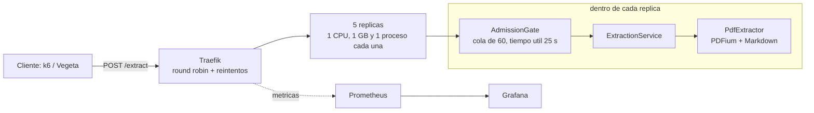

# Guia de Arquitectura

## Vision general

El proyecto sigue una arquitectura de 3 capas con influencia parcial de Hexagonal:

```text
CRUD:            Router -> DocumentService   -> Repository -> MongoDB
POST /extract:   Router -> ExtractionService -> app/core (PDFium + Markdown)
```

El CRUD registra documentos y los guarda en MongoDB. `POST /extract` es el
endpoint del TP de carga: valida y extrae sin repositorio, sin checksum y sin
escribir nada, asi sus replicas no comparten estado.

> Clasificacion honesta: **no es Clean Architecture ni Onion Architecture**.
> Es una arquitectura en 3 capas clasica, con una influencia parcial del estilo
> Hexagonal (Ports & Adapters) reflejada en la existencia de `DocumentRepository`
> como unico punto de acceso a la persistencia. Sin embargo, no existe una
> separacion estricta entre dominio e infraestructura (ver la seccion
> "Decision de arquitectura: acoplamiento Modelo/Persistencia").

## 1. Capa de presentacion

Ubicacion: `app/api/routers/`

Responsabilidades:

- recibir requests HTTP
- validar parametros de entrada
- transformar errores de negocio en respuestas HTTP
- devolver respuestas JSON

Archivos principales:

- `app/api/routers/document.py`: CRUD de documentos
- `app/api/routers/extract.py`: `POST /extract`, lee el PDF crudo o multipart en
  memoria y rechaza por `Content-Length` antes de leer si supera el limite

## 2. Capa de logica de negocio

Ubicacion: `app/services/`

Responsabilidades:

- validar el nombre del documento
- validar que el archivo sea PDF
- controlar tamano maximo
- calcular checksum
- evitar duplicados
- pedir la extraccion al nucleo (`app/core/pdf_extraction.py`)
- definir el flujo de actualizacion y borrado

Archivos principales:

- `app/services/document_service.py`: alta, consulta, actualizacion y borrado
- `app/services/extraction_service.py`: valida y extrae para `POST /extract`, sin
  persistir; registra cada extraccion en el log (bytes, paginas, ms)

## Nucleo

Ubicacion: `app/core/`

Reglas puras, sin FastAPI ni MongoDB, testeables sin levantar nada:

- `validators.py`: nombre, extension, firma `%PDF-` y tamano
- `exceptions.py`: errores de dominio; `/extract` los traduce a 400, 413 y 422
- `pdf_extraction.py`: texto y cantidad de paginas con `pypdfium2` (PDFium, el
  motor de Chrome). PDFium no es thread-safe: se serializa con un lock por
  proceso, y el paralelismo viene de los procesos de uvicorn y las replicas.
  El motor esta detras de la interfaz `PdfExtractor` (`PdfiumExtractor` por
  defecto): `ExtractionService` la recibe por constructor, asi otro motor se
  prueba y se mide sin tocar el servicio ni el router
- `markdown.py`: convierte las lineas de cada pagina a Markdown; los titulos
  salen de la altura de las letras comparada con la del cuerpo

## 3. Capa de acceso a datos

Ubicacion: `app/repositories/`

Responsabilidades:

- crear documentos en MongoDB
- buscar por `id`, `name` y `checksum`
- actualizar documentos
- eliminar documentos
- manejar el contador secuencial de IDs

Archivo principal:

- `app/repositories/document_repository.py`

## Decision de arquitectura: acoplamiento Modelo/Persistencia

### Estado actual

La clase `Document` (`app/models/document.py`) actua simultaneamente como:

- **entidad de dominio**: representa el concepto de negocio "documento PDF procesado" (nombre, checksum, texto extraido, tamano, etc.);
- **documento de base de datos**: su estructura es la que se persiste directamente en MongoDB a traves del repository.

Es decir, no existe una separacion entre un "modelo de dominio puro" y un "modelo de persistencia" propios de Clean Architecture o Onion Architecture.

### Esto es una decision consciente, no un descuido tecnico

Este acoplamiento es un **limite aceptado de forma deliberada** para el alcance actual del proyecto. Las razones son:

- **Simplicidad (KISS)**: para un CRUD con un solo agregado (`Document`), mantener dos modelos y un mapper entre ellos agregaria complejidad sin beneficio real.
- **Alcance acotado**: el dominio no tiene logica rica ni invariantes complejas que exijan aislar el modelo de la forma de persistencia.
- **Costo/beneficio**: el costo de desacoplar hoy supera el riesgo de migracion futura, dado que el seam ya esta previsto (ver abajo).

### Seam (punto de desacoplamiento futuro)

Aunque el modelo esta acoplado a la persistencia, **la frontera de desacoplamiento ya existe**: es `DocumentRepository` (`app/repositories/document_repository.py`).

Si en el futuro se necesita separar dominio de persistencia, el cambio es localizado:

1. Crear un modelo de dominio puro y un modelo de persistencia (o schema) independientes.
2. Modificar unicamente los metodos `_serialize` / `_deserialize` del repository para que actuen como mappers entre ambos modelos.

El resto de la aplicacion (routers, services) no deberia requerir cambios, porque ya consume al repository como unica via de acceso a datos. Este es el punto donde la influencia Hexagonal del diseno paga su deuda tecnica.

## Persistencia

La aplicacion usa MongoDB.

Colecciones:

- `documents`
- `counters`

Indices principales:

- `id` unico
- `checksum` unico
- `name` no unico

## Flujo del alta

1. El cliente envia `name` y `file`.
2. El router lee los bytes del archivo.
3. El service valida extension, firma y tamano.
4. El service calcula el checksum.
5. Si el checksum ya existe, rechaza el documento.
6. Si el PDF es valido, extrae el texto en memoria.
7. El repository guarda el documento en MongoDB.
8. La API devuelve el documento ya procesado.

## Flujo de extraccion

Para documentos nuevos, la extraccion ya se realiza en el alta.

`POST /api/v1/documents/{id}/extract`:

- devuelve el texto ya almacenado si el documento ya fue procesado
- conserva compatibilidad con documentos viejos que pudieran requerir reprocesamiento

`POST /extract` (sin estado) es otro flujo: recibe el PDF, lo valida, devuelve
`{"content": <Markdown>, "page_count": N}` y no guarda nada.



1. `AdmissionGate` admite el request si la cola de la replica tiene lugar; si
   no, 503 con `Retry-After` antes de leer el PDF.
2. Se lee el body en memoria (crudo o multipart) y se espera el turno: una
   extraccion por vez por proceso.
3. Si el cliente ya se fue o el request espero mas que su tiempo util, no se
   procesa. Si no, `ExtractionService` valida y el motor extrae.

## Modos de despliegue

- **Servicio completo** (`DOCUMENTS_API_ENABLED=true`, el default): CRUD +
  `POST /extract`, necesita MongoDB. Es el que usa el repo `infrastructure`.
- **Solo extractor** (`DOCUMENTS_API_ENABLED=false`): solo `POST /extract`, no
  crea indices ni se conecta a MongoDB. Es el de las 5 replicas del TP
  (`docker-compose.yml` de la raiz).

## Operacion

- `GET /health` (liveness): el proceso responde; no consulta dependencias. Lo
  usan los healthchecks de Docker, asi una caida de MongoDB no saca de servicio
  a las replicas de `POST /extract`.
- `GET /ready` (readiness): ademas verifica MongoDB (503 si no responde).
- Logs: una linea JSON por evento en stdout, incluidos los de uvicorn
  (`app/utils/structured_logging.py`, nivel por `LOG_LEVEL`).
- Administracion: `python -m app.admin.clear_documents` borra documentos con el
  mismo codigo y la misma configuracion que la API.
- Apagado ordenado: ante SIGTERM uvicorn deja de aceptar conexiones y termina
  lo que tiene en cola; Docker espera 35 s (`stop_grace_period`) antes de
  matarlo. Mientras tanto Traefik reintenta en otra replica.
- Caidas: `restart: unless-stopped` levanta la replica sola (~15 s hasta
  healthy) y Traefik reintenta en otra los requests que no llegaron a
  procesarse. Traefik es el punto unico de falla del stack del TP.
- Metricas: perfil `monitoreo` del compose (Prometheus + Grafana con las
  metricas de Traefik). Procedimientos en `docs/RUNBOOK.md`.

## Principios aplicados

- KISS: el flujo principal esta concentrado en un solo service
- DRY: el checksum y la validacion se centralizan
- SOLID: cada capa tiene una responsabilidad clara
- 12 Factor: configuracion por variables de entorno (III), procesos sin estado
  en `/extract` (VI), concurrencia por procesos y replicas (VIII), logs a stdout
  (XI) y procesos de administracion con el mismo codigo (XII)

## Dependencias relevantes

- FastAPI
- Pydantic
- PyMongo
- pypdfium2
- pytest
- mongomock

## Punto importante para clase

El proyecto ya no usa SQLite ni SQLAlchemy. Toda la persistencia actual se hace en MongoDB, que era uno de los requisitos del enunciado.

## Nota sobre `file_path`

El modelo interno todavia conserva un campo `file_path` por compatibilidad tecnica, pero en los documentos nuevos no representa una ruta real subida por el usuario.

Para los nuevos uploads se guarda solo una referencia logica interna tipo `memory://...`, ya que el procesamiento del PDF se realiza en memoria.
