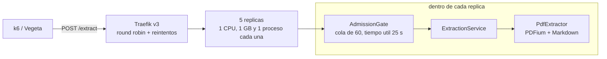

# Informe del TP: Test de Carga, Estres y Optimizacion de Microservicio

Microservicio `pdf-extractext`, version 1.3.3 (2026-10-07). Las secciones 1 a
7 son el informe; el anexo es la bitacora con cada medicion en el orden en que
se hizo. Las decisiones estan en [decisions/](decisions/README.md), el plan de
trabajo en [PLAN-TP.md](PLAN-TP.md) y los scripts en
[tests/stress](../tests/stress/README.md).

## 1. Resumen

`POST /extract` recibe un PDF y devuelve su contenido en Markdown con la
cantidad de paginas. Corre en 5 replicas sin estado de 1 CPU y 1 GB detras de
Traefik, y se levanta con `docker compose up --build`.

Medicion final en la misma notebook, intercalando la primera version con
`/extract` (v1.2.0) y la final (v1.3.0):

| Prueba | Antes (v1.2.0) | Despues (v1.3.0) | Profesor |
|---|---|---|---|
| Spike: throughput (mediana de 4) | 8,3 req/s | **10,5 req/s** | 25,35 req/s |
| Spike: p95 (mediana de 4) | 15,0 s | **11,1 s** | 8,80 s |
| Spike: errores | 0 % | 0 % | 0 % |
| Vegeta: exito | 12,3 / 13,2 % | **20,8 / 22,9 %** | 66,53 % |
| Vegeta: timeouts | 1.315 / 1.302 | **0 / 0** | 501 |
| Vegeta: p50 | 30,00 s | **0,81 / 0,11 s** | 14,89 s |

Despues de esa medicion, la 1.3.2 y la 1.3.3 subieron la cola a 60 por
replica con un tiempo util de 25 s y un margen pesimista (experimentos 9 y
13). Verificacion con `benchmark.ps1`, tres corridas seguidas de la 1.3.3:

| Prueba | Corridas | Profesor |
|---|---|---|
| Spike: throughput | 11,63 / 10,97 / 11,47 req/s (mejor del dia: 14,49) | 25,35 req/s |
| Spike: p95 | 10,43 / 11,02 / 11,29 s (mejor del dia: 7,81 s) | 8,80 s |
| Spike: errores | 0 / 0 / 0 % | 0 % |
| Vegeta: exito | 25,3 / 25,5 / 27,8 % | 66,53 % |
| Vegeta: timeouts | **0 / 1 / 0** | 501 |
| Vegeta: p50 | **2,53 / 1,85 / 1,47 s** | 14,89 s |

- **Bajo sobrecarga le ganamos al profesor**: ningun request vence por
  timeout, salvo uno suelto en una de seis corridas (el tiene 501), y la
  mediana de Vegeta es de 0,1-2,5 s contra 14,89 s.
  Lo que no se puede atender a tiempo se rechaza al instante con `503` y
  `Retry-After`.
- **En throughput no le ganamos en esta maquina**, y no se puede saber si le
  ganariamos en la suya: es una notebook con 4 nucleos fisicos para 5
  replicas, Traefik y el generador de carga, y el benchmark del profesor no
  dice en que hardware se midio. Por replica con un nucleo propio, la nuestra
  rinde **5,5-6,4 req/s** contra **5,07** de la suya (25,35 / 5).

## 2. Arquitectura y decisiones de diseno



| Decision | Por que | ADR |
|---|---|---|
| `/extract` sin estado, sin base de datos | replicas intercambiables (12-Factor VI); se pueden escalar y reintentar | [0001](decisions/0001-contrato-de-extract.md) |
| PDFium con su API cruda + Markdown por altura de letra | el motor mas rapido de los medidos, licencia Apache/BSD | [0002](decisions/0002-motor-de-extraccion-y-markdown.md) |
| Cola de 60 por replica, tiempo util de 25 s, `503` con `Retry-After` | no gastar CPU en requests que van a vencer | [0003](decisions/0003-contrapresion.md) |
| 5 replicas de 1 CPU, 1 proceso cada una, round robin | el CPU es el limite; mas procesos por replica no suman | [0004](decisions/0004-workers-y-replicas.md) |
| Reinicio automatico, reintentos de Traefik, apagado ordenado | una replica caida no tira el servicio | [0005](decisions/0005-tolerancia-a-fallos.md) |
| Medir dentro de la red de Docker, con Vegeta real, intercalando | numeros comparables y repetibles | [0006](decisions/0006-metodologia-de-medicion.md) |

Patrones aplicados: **API Gateway** (Traefik como unico punto de entrada),
**Bulkhead** (cada replica con su CPU, su memoria y su cola: una saturada no
arrastra a las demas), **backpressure** con tiempo util, **health checks**
separados (`/health` liveness, `/ready` readiness) y **retry** en el proxy.

Twelve-Factor: configuracion por variables de entorno (III), build, release y
run separados con una imagen por version y tag de git (V), procesos sin estado
(VI), port binding (VII), concurrencia por replicas (VIII), arranque en ~5 s y
apagado ordenado (IX), el mismo `docker compose` en desarrollo y en la prueba
(X), logs JSON a stdout (XI) y procesos de administracion con el mismo codigo
(XII).

## 3. Cuello de botella

1. **El CPU de la extraccion.** El 92,5 % del tiempo de una replica bajo
   carga esta en la extraccion y el 79 % dentro de las llamadas a PDFium
   (py-spy). PDFium cuesta ~1 ms por pagina, parejo en los 4 PDFs: no hay un
   PDF ni una pagina que dispare el costo. Un request cuesta 160-200 ms de CPU
   con un nucleo propio, lo que pone el techo de una replica de 1 CPU en ~5-6
   req/s. Se probaron otros dos motores y tres allocators: ninguno gana
   (anexo, experimento 6).
2. **El hardware de la notebook.** Con 4 nucleos fisicos para 5 replicas,
   Traefik y el generador de carga, el CPU por request sube de ~190 ms con 1-2
   replicas a 460 ms con 5 (experimento 5): las replicas se reparten nucleos.
   Por eso agregar replicas en esta maquina no suma despues de 3.
3. **El colapso del modelo abierto.** A 50 req/s entra el doble de lo que se
   puede procesar. Sin control, cada replica encola todo y procesa requests
   cuyo cliente ya se fue: la v1.2.0 completa 3 req/s con 1.300 timeouts, y
   el profesor 16,65 req/s con 501. No es falta de CPU sino CPU desperdiciado;
   se resuelve rechazando a tiempo (ADR 0003).
4. **El entorno de medicion** (resuelto). Desde Windows, el reenvio de puertos
   de Docker Desktop limitaba el throughput a la mitad; se mide dentro de la
   red de Docker.

## 4. Metricas antes y despues

Spike (k6, 100 VUs, 10 s / 20 s / 10 s), 4 rondas intercaladas:

| Ronda | Antes: req/s | Antes: p95 | Antes: max | Despues: req/s | Despues: p95 | Despues: max |
|---|---|---|---|---|---|---|
| 1 | 12,12 | 11,43 s | 13,68 s | 9,73 | 11,43 s | 13,58 s |
| 2 | 8,16 | 16,44 s | 18,25 s | 10,30 | 10,80 s | 12,01 s |
| 3 | 8,16 | 15,96 s | 19,16 s | 10,82 | 11,83 s | 13,41 s |
| 4 | 8,48 | 14,10 s | 15,02 s | 10,77 | 10,15 s | 10,88 s |
| **Mediana** | **8,3** | **15,0 s** | **16,6 s** | **10,5** | **11,1 s** | **12,7 s** |

Las dos versiones terminan el spike sin errores. La final rinde mas y es mas
estable (9,7-10,8 req/s contra 8,2-12,1). Vegeta (50 req/s, 30 s, timeout
30 s), 2 rondas intercaladas:

| Ronda | Antes: exito | Antes: timeouts | Antes: p50 | Despues: exito | Despues: timeouts | Despues: p50 | Despues: 503 |
|---|---|---|---|---|---|---|---|
| 1 | 12,3 % | 1.315 | 30,00 s | 20,8 % | 0 | 0,81 s | 1.188 |
| 2 | 13,2 % | 1.302 | 30,00 s | 22,9 % | 0 | 0,11 s | 1.156 |

Efecto de cada cambio, medido por separado (detalle en el anexo):

| Cambio | Efecto medido | Se adopto |
|---|---|---|
| API cruda de PDFium en vez de los objetos de pypdfium2 | -5,8 % de CPU por PDF, salida identica | si |
| Compuerta: una extraccion por vez + cola acotada | spike +16 % (10,3 -> 12 req/s) | si |
| Tiempo util de 28 s + cola de 30 | Vegeta: de cientos de timeouts a 0 | si |
| Cola de 100 | colapso en una corrida (985 timeouts) | no |
| Estimar la espera al llegar | 57-141 timeouts y un 503 en el spike | no |
| `leasttime` / `p2c` en Traefik | `leasttime` 1.172 rechazos; `p2c` igual a `wrr` | no |
| 2 procesos por replica | mismo throughput, p95 peor, doble memoria | no |
| orjson | JSON < 1 % del costo | no |
| PyMuPDF, pdf_oxide, jemalloc, mimalloc | ninguno gana | no |
| `inFlightReq` de Traefik | empate con el limite de la app | no |
| Reintentos de Traefik | 502 por caida de ~29 a ~18 | si |
| Apagado ordenado con 35 s de gracia | 0 requests perdidos al apagar una replica | si |
| Tiempo util que cuenta la extraccion (1.3.1) | Vegeta: de 19 timeouts a 0 con la maquina lenta | si |
| Cola por tamano (el PDF mas liviano primero) | spike -12 % de throughput y p95 de 12 a 17 s | no |
| Cola de 60 con margen de 4 desvios en el tiempo util | Vegeta: de ~22 % a ~30 % de exito, 0 timeouts | si |
| pypdfium2 5.14, ajustes del recolector de basura | dentro del ruido | no |
| HAProxy en lugar de Traefik | mismo CPU, spike igual o peor, 28-49 timeouts en Vegeta | no |
| 3 o 4 replicas en lugar de 5 | spike 12-13 req/s contra 14,3-14,5 | no |
| Tiempo util de 25 s en lugar de 28 | mismo exito en Vegeta y 0 timeouts en 3 corridas | si |
| Mas liviano primero con limite de 7,5 s (emulacion, un nucleo por replica) | +13 % de throughput, p50 de ~4 a ~2,1 s; p90 y p95 ~1 s mas | si (por defecto) |
| Keep-alive de uvicorn mayor que el de Traefik | sin 502 sueltos | si |
| Healthcheck liviano cada 10 s | de 12,4 % a ~3 % de un nucleo por replica | si |

## 5. Proceso de investigacion

Cada paso fue: una hipotesis, una medicion que la confirma o la descarta, y
una decision. Los errores propios tambien estan, porque cambiaron el camino.

1. **Cumplir la consigna primero** (Fase 0). `/extract` sin estado con TDD
   (commit del test en rojo, despues el verde). Para el Markdown se midieron
   librerias (AGPL o con modelos de ML) contra una heuristica propia por altura
   de letra: la propia cuesta +22 % sobre el texto plano midiendo una letra
   por linea, contra +48 % midiendo tres, con el mismo resultado.
2. **La primera medicion no tenia sentido**: el PDF de 9 MB tardaba 41 s y el
   de 0,3 MB 3 s, con las replicas al 20 % de CPU. El tiempo crecia con el
   tamano del archivo y no con las paginas: el limite era el reenvio de
   puertos de Docker Desktop. Desde entonces se mide dentro de la red de
   Docker (el throughput se duplico sin tocar el codigo).
3. **Una hipotesis equivocada**: con `docker stats` parecia que cada request
   costaba 3 veces mas CPU con 20 en vuelo, y apuntaba a la pelea entre el
   event loop y el hilo de extraccion. Leyendo el tiempo de CPU del proceso en
   `/proc` el costo resulto igual con 1, 5 o 20 requests. Se corrigio en el
   informe y el foco paso a donde se va el CPU.
4. **Perfilar antes de optimizar**: py-spy mostro 72 % en PDFium, ~10 % en los
   envoltorios de pypdfium2, ~10 % en el Markdown y ~5 % en HTTP. Se reemplazo
   el bucle de paginas por la API cruda (-5,8 %, comprobado con 30 pares
   alternados y salida identica byte a byte). El HTTP no era el problema.
5. **El modelo abierto colapsaba por trabajo desperdiciado.** Primer intento:
   estimar la espera al llegar (cantidad en cola x tiempo promedio). Fallo de
   dos formas: rechazo 1 request en el spike y, durante el ataque de Vegeta,
   la estimacion admitia de menos. Segundo intento: acotar la cola por
   cantidad y controlar el tiempo util en el momento del turno. Se midieron
   colas de 30, 60 y 100: con 100 la cola guarda mas trabajo del que entra en
   28 s y en una corrida vencio todo; con 30, cero timeouts.
6. **Un error de medicion grande**: la carga fija con k6 daba porcentajes
   inflados porque k6 descartaba iteraciones sin contarlas (no llega a crear
   los ~1.500 usuarios que hacen falta con PDFs de 9 MB). Se descarto esa
   herramienta para la carga fija, se paso a Vegeta real en un contenedor y
   el script de k6 ahora cuenta lo descartado como falla.
7. **Configuracion**: balanceo (`leasttime` empeora con rechazos), procesos por
   replica (no suman con 1 CPU) y orjson (el JSON pesa menos del 1 %), todos
   medidos y descartados.
8. **¿Por que no llegamos a 25 req/s?** Midiendo de 1 a 5 replicas, el
   throughput sube hasta 3 y se estanca, y el CPU por request crece con las
   replicas: es el hardware. Con un nucleo propio, una replica rinde mas que
   el promedio por replica del profesor.
9. **¿Se puede bajar el CPU por request?** Otros motores (PyMuPDF, pdf_oxide),
   otros allocators y quitar mas envoltorios: nada gana por fuera del ruido.
   Lo que no mejora no se commitea.
10. **Atender primero los PDFs livianos.** El p50 del profesor (1,88 s) es
    mucho menor que su promedio (100 VUs / 25,35 req/s = 3,9 s): parecia que
    sus PDFs chicos salian primero. Se probo ordenar la cola por tamano, con
    un limite de edad para que los grandes no esperen para siempre. Empeoro
    el throughput y el p95 del spike y no mejoro Vegeta: se revirtio
    (experimento 8).
11. **Limite en la app o en el proxy**: `inFlightReq` de Traefik empata en
    exito, pero es un numero fijo sin tiempo util y responde 429 sin
    `Retry-After`. Se quedo el de la app.
12. **Resiliencia** (Fase 3): la prueba de caos mostro ~29 errores por caida;
    los reintentos de Traefik los bajan a ~18 y el apagado ordenado no pierde
    ninguno. El SLO quedo cargado en los scripts para que cada corrida diga
    sola si se cumple.

Una opcion se descarto a proposito: cachear la respuesta por checksum del PDF.
Las pruebas repiten siempre los mismos 4 PDFs, asi que daria miles de req/s,
pero seria aprovechar el benchmark y no mejorar el servicio.

## 6. Comparacion con el profesor

| Prueba | Nosotros (mediana final) | Profesor | |
|---|---|---|---|
| Spike: throughput | 11-14,5 req/s segun el momento (mejor corrida: 15,34) | 25,35 req/s | peor |
| Spike: errores | 0 % | 0 % | igual |
| Spike: p95 | 7,8-11,3 s (mejor corrida: 7,53 s) | 8,80 s | mejor en las corridas buenas |
| Spike: latencia maxima | 8,7-12,8 s | 13,94 s | **mejor** |
| Vegeta: exito | 25-30 % (1.3.3) | 66,53 % | peor |
| Vegeta: timeouts | 0 (1 suelto en 6 corridas) | 501 | **mejor** |
| Vegeta: p50 | 0,1-2,5 s | 14,89 s | **mejor** |
| Por replica, con nucleo propio | 5,5-6,4 req/s | 5,07 req/s | **mejor** |

La consigna pide superarlo "bajo las mismas restricciones de hardware", y esa
condicion no se puede verificar desde aca: no se sabe en que hardware midio
el profesor ni esta disponible su microservicio para correrlo en esta
notebook. Lo que si se puede afirmar con mediciones:

- El servicio maneja la congestion como pide la nota tecnica de la consigna:
  practicamente ningun tiempo de respuesta supera el timeout.
- Cada replica, cuando tiene su nucleo, rinde mas que el promedio por replica
  del profesor. Si en su maquina cada replica tiene un nucleo libre, la
  proyeccion es ~28-32 req/s en el spike; es una proyeccion, no una medicion.
- En esta notebook el throughput absoluto varia hasta el doble entre corridas
  con el mismo codigo (de 6 a 15 req/s en el spike), por eso todas las
  comparaciones del informe son intercaladas y repetidas.

## 7. Como reproducir

Ver tambien [tests/stress/README.md](../tests/stress/README.md) y el
[runbook](RUNBOOK.md). Desde PowerShell, en la raiz del repo:

```powershell
docker compose up --build -d
# Spike con k6 (termina con codigo 99 si no se cumple el SLO)
docker run --rm --network pdf-extractext-tp_default -v "${PWD}/tests/stress:/scripts:ro" grafana/k6 run -e BASE_URL=http://traefik /scripts/spike.js
# Carga fija con Vegeta (termina con codigo 1 si algun request vence por timeout)
docker build -t vegeta:12.13.0 -f tests/stress/docker/vegeta.Dockerfile tests/stress/docker
docker run --rm --network pdf-extractext-tp_default --entrypoint bash -v "${PWD}/tests/stress:/stress" vegeta:12.13.0 /stress/vegeta.sh http://traefik/extract
# Capacidad con N replicas (3 usuarios por replica)
docker compose up -d --scale extract=1
docker run --rm --network pdf-extractext-tp_default -v "${PWD}/tests/stress:/scripts:ro" grafana/k6 run -e BASE_URL=http://traefik -e VUS=3 /scripts/escala.js
# Prueba de caos (desde Git Bash) y monitoreo
docker compose up -d
bash tests/stress/caos.sh caida 15
docker compose --profile monitoreo up -d
docker compose down
```

Antes contra despues: la imagen de la v1.2.0 se construye desde su tag con
`git archive v1.2.0 | docker build -f docker/Dockerfile -t pdf-extractext:antes -`
y se levanta con `$env:IMAGE_TAG = "antes"; docker compose up -d`.

## Anexo: bitacora de mediciones

Cada medicion en el orden en que se hizo, con las hipotesis que despues se
corrigieron marcadas como tales.

### Linea base (2026-10-02)

Stack del TP (`docker compose up --build`): 5 replicas con 1 proceso de
uvicorn cada una. Notebook con 4 nucleos fisicos y 8 hilos, Docker Desktop
sobre WSL2 (la VM de Docker tiene 8 CPUs y 10,6 GB). Spike de k6 con el perfil del profesor
(100 VUs, 10s/20s/10s), PDF como body crudo.

| Corrida | Exito | Throughput (200) | p50 | p90 | p95 | Max |
|---|---|---|---|---|---|---|
| **Profesor** | 100 % | **25,35 req/s** | 1,88 s | 7,83 s | 8,80 s | 13,94 s |
| k6 desde Windows, por HTTPS | 100 % | 3,41 req/s | 11,05 s | 41,54 s | 43,70 s | 54,34 s |
| k6 dentro de la red de Docker, por HTTP | 100 % | 7,75 req/s | 11,06 s | 15,75 s | 16,94 s | 18,68 s |
| k6 dentro de la red, **1 solo VU** | 100 % | 3,71 req/s | 0,21 s | 0,46 s | 0,69 s | 1,24 s |

#### Hallazgo 1: el reenvio de puertos de Docker Desktop distorsiona la medicion

Corriendo k6 desde Windows, el Kanban (8,9 MB) tenia una mediana de 41 s y
el Scrum Guide (0,3 MB) de 3 s: el tiempo crecia con el **tamano** del
archivo, no con su cantidad de paginas. Durante la prueba, varias replicas
estaban al 16-24 % de CPU y Traefik al 55 %: nadie estaba saturado.

El trafico de Windows a los contenedores pasa por el reenvio de puertos de
Docker Desktop hacia la VM de WSL2, que tenia que mover ~12 MB/s de uploads
concurrentes. Corriendo el mismo script en un contenedor de k6 dentro de la
red de Docker, el throughput se duplico y todos los PDFs pasaron a tardar lo
mismo (~12 s). El cuello de botella era del entorno de medicion, no del
servicio. El profesor mide en Linux, donde ese reenvio no existe, asi que
**las mediciones comparables se hacen desde dentro de la red de Docker**.

#### Hallazgo 2: con 20 requests concurrentes por replica, cada request cuesta 3 veces mas CPU

> **Corregido en la Fase 2** (ver "Diagnostico"): midiendo el tiempo de CPU
> del proceso, el costo por request es el mismo con 1, 5 o 20 requests
> concurrentes. La estimacion de abajo salia de `docker stats` con 5 replicas,
> Traefik y k6 compitiendo por los mismos nucleos.

Tiempo de CPU de la extraccion sola, en un contenedor con 1 CPU:

| PDF | Paginas | Extraccion | JSON |
|---|---|---|---|
| Scrum Guide | 16 | 53 ms | 0,3 ms |
| Essential Kanban | 90 | 214 ms | 1,5 ms |
| Filosofia Lean | 42 | 178 ms | 0,5 ms |
| Scrum Manager | 62 | 352 ms | 0,8 ms |
| **Promedio** | | **~200 ms** | |

Con ~200 ms por PDF, 5 replicas de 1 CPU tienen un techo teorico de
**~25 req/s**, el mismo numero que el profesor. Con un solo usuario la
mediana es 0,21 s, coherente con ese costo. Pero con 100 VUs (20 requests en
vuelo por replica) las 5 replicas estan al 100 % de CPU y procesan 1,55
req/s cada una: **~0,65 s de CPU por request**, el triple.

El costo extra aparece solo con concurrencia: dentro de cada proceso compiten
el event loop (recibiendo 20 uploads a la vez) y el hilo que extrae, por el
mismo GIL y por la misma cuota de 1 CPU. Es exactamente lo que apuntan las
pistas 2 y 4 de la consigna (control de concurrencia y pool de workers
separado del runtime HTTP), y es lo primero a atacar en la Fase 2 del plan.

### Fin de la Fase 0 (2026-10-02, version 1.2.0)

Con todos los requisitos de la consigna cumplidos: `/extract` devuelve
Markdown, 5 replicas sin estado con limites de recursos y ruta directa en
Traefik. Spike del profesor con k6 dentro de la red de Docker:

| Corrida | Exito | Throughput (200) | p50 | p90 | p95 | Max |
|---|---|---|---|---|---|---|
| **Profesor** | 100 % | **25,35 req/s** | 1,88 s | 7,83 s | 8,80 s | 13,94 s |
| Linea base (texto plano) | 100 % | 7,75 req/s | 11,06 s | 15,75 s | 16,94 s | 18,68 s |
| **Fase 0 (Markdown)** | 100 % | 5,80 req/s | 13,99 s | 17,82 s | 18,90 s | 20,88 s |

#### Costo del Markdown

El Markdown se arma con una heuristica propia (`app/core/markdown.py`): la
altura de letra mas frecuente es el cuerpo, y las lineas cortas con letra
1,15x / 1,35x / 1,8x mas grande son titulos de nivel 3, 2 y 1. No se uso una
libreria porque las que generan Markdown de PDF son AGPL (PyMuPDF4LLM) o
cargan modelos de ML, mucho mas lentos.

Tiempo de CPU promedio de los 4 PDFs en un contenedor con 1 CPU:

| Version | Extraccion | Sobre el texto plano |
|---|---|---|
| Texto plano | 124 ms | - |
| Markdown, mediana de 3 letras por linea | 178 ms | +48 % |
| **Markdown, 1 letra cerca del centro** | **151 ms** | **+22 %** |

Medir una sola letra da exactamente el mismo Markdown en los 4 PDFs. La caida
de throughput entre la linea base y la Fase 0 (7,75 -> 5,80 req/s) es mayor
que ese +22 %: las corridas en Docker Desktop tienen bastante variacion entre
si, algo a controlar en la Fase 2 repitiendo cada medicion.

#### Memoria

Pico de memoria por replica durante el spike: entre 363 y 440 MiB. El limite
de 1 GB deja margen; uno de 512 MB quedaria al borde de que Docker mate el
contenedor por falta de memoria.

### Fase 2: diagnostico (2026-10-05)

#### Hardware

AMD Ryzen 5 3450U de notebook: **4 nucleos fisicos con SMT (8 hilos)**, 2,1 GHz
base, 22 GB de RAM. Docker Desktop le da 8 CPUs a su VM, pero son 8 hilos de 4
nucleos: las 5 replicas de "1 CPU", Traefik y el generador de carga compiten
por 4 nucleos reales. El benchmark del profesor no dice en que hardware se
midio.

#### Linea base de la Fase 2 (version 1.2.0 + Fase 1, k6 dentro de la red)

| Prueba | Exito | Throughput (200) | p50 | p90 | p95 | Max |
|---|---|---|---|---|---|---|
| Spike, corrida 1 | 100 % | 9,30 req/s | 8,80 s | 11,94 s | 12,48 s | 13,30 s |
| Spike, corrida 2 | 100 % | 9,25 req/s | 8,56 s | 11,17 s | 12,91 s | 14,09 s |
| Carga fija 50 req/s (`carga_fija.js`) | **37,1 %** | **2,93 req/s** | 29,99 s | 30,00 s | 30,00 s | 30,09 s |

El spike subio de 5,80 a 9,3 req/s respecto del cierre de la Fase 0; el cambio
mas probable es la imagen en Python 3.14 (antes 3.13), queda para verificar.

**La carga fija colapsa:** con ~9 req/s de capacidad, el servicio completa solo
2,93 req/s efectivos y 298 requests vencen por timeout. Es el colapso por
congestion: las replicas siguen procesando requests cuyo cliente ya se fue a
los 30 s, y ese trabajo se tira mientras los requests nuevos esperan en cola.

#### CPU por request segun la concurrencia

Una replica sola (1 CPU), 200 requests con k6, tiempo de CPU del proceso leido
de `/proc`:

| Requests concurrentes | CPU por request | Throughput | p50 |
|---|---|---|---|
| 1 | 291 ms | 3,07 req/s | 0,27 s |
| 5 | 288 ms | 3,20 req/s | 1,39 s |
| 20 | 314 ms | 2,85 req/s | 5,59 s |

El costo por request **no depende de la concurrencia**: el hallazgo 2 de la
Fase 0 estaba mal. Una replica procesa ~3 req/s; 5 replicas, ~15 req/s si
tuvieran 5 nucleos libres, que esta PC no tiene.

#### Donde se va el CPU

- Logs del servidor (`pdf_extraido`), un usuario: la extraccion dura 133 ms
  (Scrum Guide), 191 ms (Lean), 240 ms (Scrum Manager) y 339 ms (Kanban),
  **~226 ms en promedio de ~290 ms totales: el 78 %**.
- Perfil con py-spy de una replica bajo carga (4.333 muestras en 30 s):

| Donde | Muestras |
|---|---|
| PDFium cargando cada pagina (`get_page`) | 44 % |
| PDFium armando el texto de la pagina (`get_textpage`) | 28 % |
| Envoltorios de pypdfium2 (cerrar objetos, finalizadores con weakref) | ~10 % |
| Nuestro Markdown y la medicion de alturas | ~10 % |
| HTTP: recibir el body, FastAPI, JSON | ~5 % |

**Conclusiones para los experimentos:**

1. El costo esta en la extraccion misma, no en la infraestructura HTTP: no hay
   que buscar el problema en uvicorn ni en Traefik.
2. ~10 % se va en los objetos de pypdfium2 (cada pagina y cada pagina de texto
   se envuelven en objetos Python con finalizadores). Usar la API cruda de
   PDFium en el bucle de paginas puede ahorrarlo.
3. En el modelo abierto el problema es el trabajo desperdiciado: hace falta
   backpressure (rechazar rapido lo que no se va a poder atender a tiempo) y
   dejar de procesar requests cuyo cliente ya se desconecto.
4. Con 1 CPU por replica, mas procesos por replica (`WEB_CONCURRENCY`) o un
   pool de procesos no agregan capacidad: a lo sumo separan el HTTP de la
   extraccion. Hay que medirlo, pero no es donde esta la ganancia.

### Fase 2: experimentos

#### Como se mide

La notebook cambia de frecuencia segun temperatura y energia (de 2,1 a 3,5 GHz):
la misma imagen dio de 160 a 290 ms de CPU por request en distintos momentos,
y el throughput del spike vario entre 6 y 12 req/s con el mismo codigo. Para
que una comparacion valga:

- Las configuraciones se miden **intercaladas** (A, B, C, A, B, C...) y cada
  una al menos dos veces, asi el ruido afecta a todas por igual.
- Los cambios de CPU puro se comparan **en el mismo proceso**: la version vieja
  (sacada de git) y la nueva, alternadas 30 veces con los 4 PDFs.
- El spike (modelo cerrado) se mide con k6 y la carga fija (modelo abierto) con
  **Vegeta**, los dos dentro de la red de Docker (ver hallazgo 1).

#### Error de medicion corregido: la carga fija con k6

Las primeras mediciones de la carga fija se hicieron con `carga_fija.js` (k6,
executor de tasa constante). Daban porcentajes de exito inflados: cada usuario
virtual de k6 carga los 4 PDFs (13,7 MB) y, con requests que esperan ~30 s,
hacen falta ~1.500 a la vez. k6 no llega a crearlos y **descarta iteraciones
sin contarlas**: en varias corridas mando entre 500 y 700 de los 1.500
requests, y el porcentaje se calculaba sobre esos. Esas mediciones se
descartaron. Desde entonces la carga fija se mide con Vegeta 12.13.0 en un
contenedor (`tests/stress/docker/vegeta.Dockerfile`), y `carga_fija.js` cuenta
las iteraciones descartadas como fallas y avisa.

#### Experimento 1: API cruda de PDFium (F2-8)

El perfil mostraba ~10 % del CPU en los envoltorios de pypdfium2 (cada pagina
y cada pagina de texto es un objeto Python con finalizadores). El bucle de
paginas paso a usar los handles crudos (`FPDF_LoadPage`, `FPDFText_LoadPage`,
`FPDFText_GetText`) y a cerrarlos a mano.

| Version | CPU por PDF (mediana de 30) |
|---|---|
| pypdfium2 | 117,8 ms |
| API cruda | 111,0 ms (**-5,8 %**, gana en 24 de 30 pares) |

Salida identica byte a byte (texto y Markdown de los 4 PDFs). Menos que el 10 %
del perfil: abrir y cerrar cada pagina hay que hacerlo igual; se ahorra solo
el envoltorio.

#### Experimento 2: compuerta de admision (F2-1 y F2-3)

`app/services/admission.py`, una por proceso:

1. **Cola acotada**: admite hasta `EXTRACT_MAX_PENDING` requests; llena, 503
   con `Retry-After` al instante, sin leer el PDF.
2. **Una extraccion por vez** en un semaforo de asyncio: antes cada request
   bloqueaba un hilo contra el lock de PDFium; ahora el event loop atiende HTTP
   y la extraccion va aparte (pista 4 de la consigna).
3. **Tiempo util**: si cuando le toca el turno el cliente ya se fue, o si
   espero mas de `EXTRACT_MAX_WAIT_SECONDS` (28 s), no se procesa (pista 2).

**Spike** (k6, 100 VUs, intercalado, 2 rondas):

| Version | Throughput | p50 | p95 |
|---|---|---|---|
| Fase 1 | 10,09 / 10,52 req/s | 8,49 / 7,45 s | 10,83 / 11,21 s |
| Compuerta | **11,80 / 12,25 req/s** | **6,82 / 6,66 s** | **9,39 / 9,06 s** |

+16 % de throughput con 100 % de exito. En el spike la compuerta nunca rechaza
(unos 20 requests por replica): la mejora viene de no tener 20 hilos peleando
por el lock de PDFium en cada replica.

##### Como se eligio el criterio de admision

La primera version estimaba la espera al llegar (pendientes x tiempo de
servicio promedio) y rechazaba si superaba el maximo. Problemas encontrados:

- Con un promedio que pesaba ~5 extracciones, un par de PDFs grandes seguidos
  lo inflaba y llego a rechazar **1 request en el spike** (que tiene que dar
  0 % de error).
- Con Vegeta, la prueba terminaba a los ~45 s cuando el timeout permite
  trabajar hasta los ~60 s: durante el ataque la CPU esta saturada (Vegeta y
  Traefik mueven ~167 MB/s de PDFs) y cada extraccion tarda mas, pero esa cola
  se vacia mucho mas rapido cuando el ataque termina. Una estimacion hecha en
  el momento admite de menos.

Por eso la cola paso a acotarse **por cantidad**, y el tiempo util lo controla
el chequeo exacto en el turno. **Carga fija con Vegeta** (50 req/s, 30 s,
timeout 30 s, 1.500 requests enviados), tres rondas intercaladas:

| Criterio | Exito | Timeouts | p50 | Pico de memoria |
|---|---|---|---|---|
| Estimacion de espera | 20,7 / 23,1 / 25,5 % | 141 / 57 / 26 | 0,1-3,1 s | ~540 MiB |
| **Cola de 30** | **21,5 / 25,8 / 24,0 %** | **0 / 0 / 0** | **~0,1 s** | **~390 MiB** |
| Cola de 100 | 26,1 / 32,7 / **7,7 %** | 117 / 4 / **985** | hasta 30 s | ~600 MiB |

Con 30, todo lo admitido se atiende antes de los 28 s. Con 100 la cola guarda
mas trabajo del que entra en el tiempo util: en una corrida todo vencio
esperando (colapso de una cola FIFO sobrecargada). El spike con cola de 30 sigue
en 100 % de exito sin ningun 503.

#### Experimento 3: estrategia de balanceo de Traefik (F2-5)

Spike con k6, dos rondas intercaladas:

| Estrategia | Throughput | Errores |
|---|---|---|
| `wrr` (round robin) | 11,59 / 8,37 req/s | 0 / 1 (el 503 de la estimacion) |
| `p2c` (de dos al azar, la de menos en vuelo) | 11,08 / 11,55 req/s | 0 / 0 |
| `leasttime` (la que responde mas rapido) | 11,91 / 5,75 req/s | 0 / **1.172 rechazos** |

`leasttime` se descarto: cuando hay rechazos, la replica que "responde mas
rapido" es la que esta devolviendo 503, y le manda todavia mas trafico.
Entre `wrr` y `p2c` la diferencia queda dentro del ruido; se mantiene `wrr`
(configurable con `LB_STRATEGY`).

#### Experimento 4: dos procesos por replica (F2-2)

Spike con `WEB_CONCURRENCY=2`: 11,02 / 11,32 / 11,61 req/s, igual que con 1
proceso, y p95 peor (~12,2 s contra ~10 s). Con 1 CPU de limite, dos procesos
se reparten el mismo nucleo; ademas cada uno tiene su cola, asi que duplica la
memoria de PDFs en espera. Se mantiene 1 proceso por replica.

#### Descartados por medicion (F2-7)

Serializar la respuesta cuesta 0,3-1,5 ms contra 150-300 ms de extraccion
(menos del 1 %): orjson no justifica una dependencia nueva.

#### Experimento 5: cuanto rinde cada replica (2026-10-06)

Carga cerrada constante (`tests/stress/escala.js`, 3 usuarios por replica,
60 s), variando la cantidad de replicas. El CPU por request sale del cgroup de
las replicas (`usage_usec` antes y despues).

| Replicas | req/s (ronda 1) | CPU por request | req/s (ronda 2) | CPU por request |
|---|---|---|---|---|
| 1 | 5,05 | 202 ms | 3,27 | 307 ms |
| 2 | 9,48 | 189 ms | 5,33 | 393 ms |
| 3 | 12,68 | 237 ms | - | - |
| 4 | 12,38 | 320 ms | - | - |
| 5 | 10,98 | 460 ms | 17,10 | 285 ms |

- En la ronda 1 escala casi lineal hasta 2 replicas y se estanca desde 3: el
  CPU por request **sube** con las replicas (de ~190 a 460 ms) aunque el codigo
  es el mismo. Con 4 nucleos fisicos para 5 replicas, Traefik y k6, los
  procesos comparten nucleo (hyperthreading) y la frecuencia baja.
- La ronda 2, con el mismo codigo, da otra forma (1 y 2 replicas mas lentas,
  5 mas rapidas): la frecuencia de la notebook cambio durante la medicion.
  Los numeros absolutos de esta maquina varian hasta 2 veces entre corridas.

Con una sola replica y 2 usuarios, en 5 corridas de 40 s: **5,5-6,4 req/s**,
con **159-186 ms de CPU por request**. El benchmark del profesor equivale a
25,35 / 5 = **5,07 req/s por replica**. Si cada una de las 5 replicas tuviera
su nucleo a esta velocidad, serian ~28-32 req/s. Es una **proyeccion**, no una
medicion: supone que el resto de la maquina (proxy y generador de carga) no le
quita CPU a las replicas, cosa que en esta notebook no pasa.

#### Experimento 6: bajar el CPU por request (2026-10-06)

Desglose en el mismo proceso (los 4 PDFs, 8 repeticiones):

| Etapa | Costo | Parte |
|---|---|---|
| `FPDF_LoadPage` (PDFium interpreta la pagina) | 68 ms | 46 % |
| `FPDFText_LoadPage` (PDFium arma el texto) | 55 ms | 37 % |
| Medir la altura de las lineas (Python + PDFium) | 9 ms | 6 % |
| Armar el Markdown (Python) | 5 ms | 3 % |
| Copiar el texto, abrir y cerrar el documento | 5 ms | 4 % |

Por pagina, PDFium cuesta ~1 ms parejo: ningun PDF ni pagina en particular
dispara el costo. Con py-spy dentro del contenedor y bajo carga, el 92,5 % de
las muestras estan en la extraccion (79 % dentro de las llamadas a PDFium) y
~7 % en la capa HTTP. Lo que se probo para bajarlo:

| Intento | Resultado | Decision |
|---|---|---|
| PyMuPDF (MuPDF) | texto plano 108 ms, con tamanos de letra 129 ms, contra ~120 ms de PDFium | Descartado: no gana y es AGPL |
| pdf_oxide (Rust, MIT/Apache) | 356-467 ms por PDF, 2 a 3 veces mas lento | Descartado |
| jemalloc / mimalloc / umbral de mmap de glibc | dentro del ruido (+-10 % entre corridas) | Descartado |
| Abrir el documento y medir las letras sin envoltorios de pypdfium2 | -1,2 % y +1,8 % en dos A/B de 30 pares, salida identica | Descartado (no se commitea) |

Conclusion: ~85 % del CPU por request esta dentro de PDFium, el motor mas
rapido de los tres probados, y lo que queda en Python no se puede bajar de
forma medible. Para esta carga, el CPU por request esta en su piso.

#### Experimento 7: limite en la app o en Traefik (F2-4, 2026-10-06)

Traefik trae el middleware `inFlightReq`: limita los requests en vuelo y
responde 429 al resto. Se comparo con Vegeta (50 req/s, 30 s), dos rondas
intercaladas:

- **app**: la compuerta de la app (cola de 30 por replica, tiempo util de
  28 s), sin limite en Traefik.
- **traefik**: `inFlightReq` con 150 en vuelo (5 x 30, comun a todos los
  clientes) y la compuerta de la app sin limite.
- **ambos**: las dos cosas.

| Configuracion | Exito | Rechazos | Timeouts | p50 | Pico de memoria |
|---|---|---|---|---|---|
| app | 32,7 / 20,7 % | 1.009 / 1.190 (503) | 0 / 0 | 0,07 / 0,13 s | ~420 MiB |
| traefik | 26,2 / 25,3 % | 1.107 / 1.120 (429) | 0 / 0 | 0,01 / 0,01 s | ~340 MiB |
| ambos | 22,5 / 25,1 % | ~1.130 (429 + 503) | 0 / 0 | 0,02 / 0,02 s | ~330 MiB |

El exito queda dentro del ruido de esta maquina: ninguna gana. Traefik usa
menos memoria en las replicas porque rechaza antes de reenviarles el PDF.
**Se mantiene el limite en la app**, sin el de Traefik:

- Con 150 en vuelo no hubo timeouts porque el numero coincide con lo que las
  5 replicas terminan en 28 s **en esta maquina y con estos PDFs**. Es un
  numero fijo: con PDFs mas pesados o una CPU mas lenta, los admitidos vencen
  esperando. La app corta por tiempo util en el momento del turno, asi que
  nunca procesa algo que ya vencio.
- La app responde 503 con `Retry-After`; `inFlightReq` responde 429 sin
  decirle al cliente cuando reintentar, y 429 significa "este cliente pide
  demasiado", no "el servicio esta saturado".
- El limite de Traefik es comun a todas las replicas; el de la app es por
  replica, y la protege tambien cuando se la usa sin este proxy (por ejemplo,
  desde `infrastructure`).

#### Estado al cierre de los experimentos

| Prueba | Nosotros | Profesor |
|---|---|---|
| Spike, throughput | ~11-12 req/s | 25,35 req/s |
| Spike, p50 / p95 | ~7 s / ~9,5 s | 1,88 s / 8,80 s |
| Spike, errores | 0 % | 0 % |
| Vegeta, exito | ~24 % | 66,53 % |
| Vegeta, timeouts | **0** | 501 |
| Vegeta, p50 | **~0,1 s** | 14,89 s |

La capacidad bruta (req/s) sigue siendo la mitad. Lo que se gano es
comportamiento bajo sobrecarga: ningun request vence por timeout, los rechazos
son instantaneos y con `Retry-After`, la memoria esta acotada y no se gasta CPU
en respuestas que nadie va a leer.

**La comparacion absoluta no es justa**: esta PC es una notebook de 15 W con 4
nucleos para 5 replicas, Traefik y el generador de carga, y el benchmark del
profesor no dice en que hardware se midio (ni su microservicio de referencia
esta disponible para correrlo aca). La comparacion por replica del
experimento 5 es la mas justa que se puede hacer: con su nucleo propio, una
replica rinde 5,5-6,4 req/s contra 5,07 del profesor.

### Fase 3: principios (2026-10-06)

#### SLO

Objetivos de nivel de servicio del stack del TP, cargados en los scripts para
que una medicion diga sola si se cumplen:

| Prueba | Objetivo | Donde se controla |
|---|---|---|
| Spike | al menos 99 % de los PDFs extraidos | `thresholds` de `spike.js` |
| Spike | p95 de las respuestas 200 menor a 12 s | idem |
| Spike | ninguna respuesta 200 cerca del timeout (max < 30 s) | idem |
| Spike | throughput de al menos 8 req/s (depende del hardware, `SLO_RPS`) | idem |
| Carga fija | ningun request vence por timeout: lo que no se atiende se rechaza al instante | `vegeta.sh` / `vegeta.ps1` |

Si no se cumplen, k6 termina con codigo 99 y Vegeta con codigo 1. En la
verificacion: spike con **15,34 req/s, 100 % de exito, p95 7,53 s y maximo
8,29 s** (p90, p95 y maximo mejores que los del profesor) y Vegeta sin ningun
timeout.

#### Tolerancia a fallos: prueba de caos

`tests/stress/caos.sh` corre el spike y a los 15 s tira una replica. La caida
se simula matando el proceso con `kill -9` desde fuera del contenedor: un
`docker kill` cuenta como apagado manual y Docker no la reiniciaria.

| Escenario | Respuestas | Exito | Replica healthy de nuevo |
|---|---|---|---|
| Caida, sin reintentos | 446 ok, 31 x 502, 4 x 503 | 92,7 % | 15 s |
| Caida, sin reintentos | 431 ok, 27 x 502 | 94,1 % | 14 s |
| Caida, con reintentos de Traefik | 414 ok, 19 x 502 | 95,6 % | 24 s |
| Caida, con reintentos de Traefik | 442 ok, 18 x 502, 3 x 503 | 95,5 % | 14 s |
| Apagado ordenado, 10 s de gracia | 408 ok | 100 % | 31 s |
| Apagado ordenado, 10 s de gracia | 521 ok, 2 x 503 | 99,6 % | 17 s |
| Apagado ordenado, 35 s de gracia | 464 ok | 100 % | 19 s |
| Apagado ordenado, 35 s de gracia | 465 ok, 1 x 502, 1 x 503 | 99,6 % | 30 s |

- **Caida**: los 502 son los requests que estaban en la cola de la replica
  que murio; ese trabajo se pierde con el proceso. El middleware `retry` de
  Traefik (3 intentos) reintenta en otra replica los que no llegaron a
  procesarse y baja los 502 de ~29 a ~18. Es seguro porque `/extract` no tiene
  estado: procesar dos veces el mismo PDF no cambia nada. Se adopto.
- **Apagado ordenado** (SIGTERM, como en un deploy): uvicorn deja de aceptar
  conexiones y termina su cola (9-12 s); Traefik manda lo nuevo a otra
  replica. No se perdio ningun request. Con este spike 10 s de gracia
  alcanzan, pero un request admitido puede esperar hasta 28 s: se fijo
  `stop_grace_period: 35s` para que Docker no lo mate a mitad de camino.
- Los 503 sueltos son las otras replicas absorbiendo la carga de la caida con
  su cola llena: rechazo inmediato, no timeout.

**Puntos unicos de falla**:

| Componente | Efecto | Medido |
|---|---|---|
| Traefik (una instancia) | no responde nada | `kill -9`: 4,3 s sin servicio hasta que Docker lo reinicia |
| El host de Docker | todo el stack | no se mide: requiere otra maquina |
| MongoDB (solo en `infrastructure`) | el CRUD; `/extract` sigue funcionando porque `/health` no depende de la base | Fase 1 |

#### Apagado y arranque (12-Factor IX)

- Arranque: ~5 s desde `docker run` hasta que `/health` responde (medido con
  `docker exec`, que suma su propia demora). Una replica caida vuelve a estar
  healthy en ~15 s, porque el healthcheck corre cada 5 s.
- Apagado: ordenado ante SIGTERM, ver la prueba de caos.

#### Plan de capacidad

Con los numeros de la Fase 2 (experimentos 5 y 6):

| Magnitud | Valor |
|---|---|
| CPU por request (mezcla de los 4 PDFs) | 160-200 ms con nucleo propio; hasta 460 ms con nucleos compartidos |
| Capacidad de una replica (1 CPU) | ~5-6 req/s |
| 5 replicas con un nucleo libre cada una | ~25-30 req/s (proyeccion) |
| 5 replicas en la notebook del grupo (4 nucleos) | 11-17 req/s medidos |
| Memoria pico por replica | ~420 MiB bajo Vegeta (limite: 1 GB) |
| Cola por replica | 30 requests, ~6-15 s de espera maxima |

Capacidad = replicas x 1.000 / CPU por request (ms), mientras cada replica
tenga su nucleo. Para mas carga hacen falta mas nucleos: agregar replicas en
la misma maquina no suma (experimento 5) y la consigna limita a 5. Lo que
supere la capacidad se rechaza con 503 en vez de vencer por timeout.

#### Monitoreo

Perfil `monitoreo` del compose: Traefik expone metricas Prometheus, Prometheus
las lee cada 5 s y Grafana muestra el dashboard "TP - POST /extract"
(respuestas por codigo, latencia p50/p95, porcentaje de 503, conexiones y
reintentos). Es opcional para no sacarle CPU a las replicas al medir. Los logs
JSON de cada replica son la otra fuente (Fase 1).

#### Estabilidad, documentacion y codigo

- Cada version tiene su tag de git (`v1.0.0` a `v1.3.0`) y su imagen Docker.
- `docs/RUNBOOK.md`: que hacer ante saturacion, caidas, deploys y rollback.
- `ARCHITECTURE.md`: diagrama del stack del TP y flujo de `/extract`.
- El motor de extraccion esta detras de la interfaz `PdfExtractor` (TDD:
  `2033abd` en rojo, `e63074a` en verde): los intentos con otros motores de la
  Fase 2 se pueden repetir sin tocar el servicio ni el router.

### Version 1.3.1: el tiempo util cubre la respuesta (2026-10-06)

En una corrida de Vegeta con la notebook lenta aparecio **1 timeout**
(30,004 s) y el SLO no se cumplio. La compuerta controlaba solo la espera: un
request que empezaba a los 27,9 s de 28 tardaba mas de 2 s en extraerse y
llegaba despues del timeout del cliente. Ahora, en el turno, se rechaza si lo
que espero **mas una extraccion promedio** (el promedio que la compuerta ya
aprende) supera el tiempo util (TDD: `99e3d08` en rojo, `c5c3851` en verde).

Vegeta, dos rondas intercaladas:

| Version | Exito | Timeouts | p50 |
|---|---|---|---|
| 1.3.0 | 15,7 / 21,9 % | **19** / 0 | 1,28 / 0,11 s |
| 1.3.1 | 22,4 / 22,7 % | **0 / 0** | 0,10 / 0,12 s |

El spike con la 1.3.1 sigue sin errores (11,42 req/s, p95 9,67 s, SLO
cumplido): con esperas de ~10 s el chequeo nunca rechaza.

### Experimento 8: cola por tamano (2026-10-07, descartado)

Hipotesis: con 100 VUs la latencia promedio es 100 / throughput (ley de
Little), pero la mediana depende del orden de la cola. El profesor tiene p50
1,88 s con un promedio de ~3,9 s, asi que sus PDFs livianos parecen salir
primero; la nuestra atiende por orden de llegada y todos tardan parecido.

Se implemento con TDD (`7a520ac` en rojo, `a12fc73` en verde): el turno es del
PDF de menos bytes que espera (con los 4 PDFs oficiales el orden por tamano
coincide con el de costo en PDFium), y el que ya espero 14 s pasa primero para
que los grandes no se queden sin turno. Misma imagen, cambiando solo
`EXTRACT_QUEUE_ORDER`, dos rondas intercaladas:

| Orden | Spike req/s | Spike p50 | Spike p95 | Vegeta exito |
|---|---|---|---|---|
| Por llegada | 10,37 / 10,64 | 8,31 / 7,27 s | 11,77 / 12,10 s | 21,4 % |
| Por tamano | 9,43 / 8,58 | 6,58 / 9,66 s | **16,40 / 17,55 s** | 22,5 % |

Empeoro el throughput y el p95 en las dos rondas, y la mediana bajo solo en
una. Con 100 usuarios en un modelo cerrado, los que tienen PDFs grandes se
acumulan detras de los chicos hasta que el limite de edad los hace pasar: la
cola termina funcionando como por llegada pero con los grandes mas
atrasados. Se revirtio (`083fdbb`, `4a89033`); el codigo vuelve a ser el de
la 1.3.1.

### Experimento 9: cola mas larga con un margen por desvio (2026-10-07)

Con el tiempo util exacto de la 1.3.1, una cola mas larga deberia completar
mas requests en Vegeta sin producir timeouts. Primera tanda (1.3.1, Vegeta,
dos rondas intercaladas):

| Cola | Exito | Timeouts |
|---|---|---|
| 30 | 18,9 / 25,2 % | **4** / 0 |
| 45 | 29,5 / 32,3 % | 0 / 0 |
| 60 | 32,7 / 35,7 % | 0 / 0 |
| 60 (otra tanda) | 27,5 / 20,7 % | 0 / **6** |
| 90 | 20,6 / 31,1 % | **215 / 40** |
| 120 | 32,5 / 32,4 % | **77 / 162** |

La cola mas larga sube el exito, pero el chequeo con el tiempo **promedio**
de extraccion no alcanza: con la maquina saturada un PDF grande tarda varias
veces el promedio y vence igual. Se cambio el margen por el del temporizador
de retransmision de TCP (RFC 6298): promedio + 4 desvios, los dos promedios
moviles (TDD: `aa4138f` en rojo, `699eec2` en verde). Con ese margen:

| Cola | Exito | Timeouts | Memoria pico |
|---|---|---|---|
| 45 | 28,7 / 28,9 % | 0 / 0 | ~420 MiB |
| **60** | **30,8 / 30,3 %** | **0 / 0** | ~510 MiB |
| 90 | 31,5 / 30,7 % | 1 / **72** | ~610 MiB |

Se fijo la cola en **60 por replica**: mas exito que con 30 (~22 % de
mediana en las mediciones anteriores) sin timeouts y con la mitad del limite
de memoria. Con 90 la ganancia es minima y los timeouts vuelven. En el spike
la cola no influye: hay ~20 requests por replica y nunca se llena.

### Experimento 10: lo que quedaba para el CPU por request (2026-10-07)

Medido en el mismo contenedor de 1 CPU, alternando:

| Intento | Resultado | Decision |
|---|---|---|
| pypdfium2 5.14.0 (PDFium mas nuevo) contra 5.8.0 | mediana 148 contra 152 ms por PDF, gana 4 de 6 pares, misma salida byte a byte | dentro del ruido: no se cambia |
| Recolector de basura de Python (umbral alto o apagado) | 3 recolecciones por PDF; 146-151 ms contra 150-153 ms | sin efecto |

Con esto el CPU por request queda en su piso: PDFium y lo minimo de Python.

### Experimento 11: HAProxy en lugar de Traefik (2026-10-07)

Hipotesis: un proxy escrito en C le devuelve CPU a las replicas. Primero se
midio cuanto usa el proxy a mitad del spike: **Traefik ~17-28 % de un nucleo
y k6 ~15-36 %**. HAProxy 3.2 con round robin, `retries 3`, `option
redispatch` y chequeo de `/health`, mismas replicas, dos rondas intercaladas:

| Proxy | Spike req/s | Spike p95 | Vegeta exito | Vegeta timeouts | CPU del proxy |
|---|---|---|---|---|---|
| Traefik | 13,53 / 13,66 | 8,99 / 9,61 s | 27,7 / 33,5 % | **0 / 0** | 23 / 28 % |
| HAProxy | 11,59 / 13,07 | 10,41 / 9,07 s | 30,1 / 33,7 % | **49 / 28** | 22 / 17 % |

HAProxy gasta casi lo mismo y en Vegeta deja vencer requests. Se mantiene
Traefik. (Una primera tanda se descarto porque quedaron dos scripts de
medicion corriendo a la vez y se pisaron los stacks.)

### Experimento 12: cuantas replicas para el spike (2026-10-07)

En el experimento 5, con carga constante, 3 o 4 replicas rendian igual que
5 en la notebook. Con el spike del profesor, dos rondas intercaladas:

| Replicas | req/s | p50 | p95 | max |
|---|---|---|---|---|
| 3 | 12,06 / 11,44 | 7,50 / 7,09 s | 9,14 / 9,69 s | 10,09 / 10,10 s |
| 4 | 13,15 / 13,09 | 6,62 / 6,20 s | 8,38 / 8,92 s | 10,08 / 10,04 s |
| **5** | **14,49 / 14,27** | **5,97 / 5,77 s** | **7,81 / 8,36 s** | **8,71 / 9,73 s** |

Con el spike, 5 replicas es lo mejor, y el p95 queda por debajo del del
profesor (8,80 s). Se mantienen 5.

### Experimento 13: holgura del tiempo util (2026-10-07, version 1.3.3)

Tres corridas seguidas de `benchmark.ps1` con la 1.3.2 dieron 4, 0 y 17
timeouts en Vegeta: el margen pesimista cubre la extraccion, pero no lo que
la compuerta no ve (devolver ~700 KB de Markdown por Traefik con la maquina
saturada). Vegeta, tres rondas intercaladas:

| Configuracion | Exito | Timeouts |
|---|---|---|
| Cola 60, tiempo util 28 s | 32,0 / 27,5 / 28,7 % | 0 / 0 / 2 |
| **Cola 60, tiempo util 25 s** | **29,4 / 29,6 / 29,1 %** | **0 / 0 / 0** |
| Cola 45, tiempo util 28 s | 22,9 / 27,7 / 27,3 % | 5 / 0 / 0 |

Con 25 s el exito es practicamente el mismo, el mas estable de los tres, y
no hubo ningun timeout. Se fijo `EXTRACT_MAX_WAIT_SECONDS=25`.

### Experimento 14: simulacion del spike y emulacion a escala (2026-10-07)

Para no depender del ruido de la notebook se escribio una simulacion del
spike (`tests/stress/simulacion_spike.py`): 100 usuarios con las rampas del profesor, 5 replicas con round robin y
el costo medido de cada PDF. Con los costos multiplicados por 2,2 (lo que
cuesta cada PDF con 5 replicas en la notebook) reproduce lo medido: FIFO da
12,6 req/s, p50 7,4 s y p95 11 s.

| Politica, con un nucleo por replica (simulada) | req | req/s | p50 | p90 | p95 | max |
|---|---|---|---|---|---|---|
| Profesor (medido por el) | 1.037 | 25,35 | 1,88 | 7,83 | 8,80 | 13,94 |
| FIFO | 1.000 | 25,00 | 3,46 | 4,86 | 5,07 | 5,89 |
| Mas liviano primero, sin limite | 1.072 | 26,80 | 0,36 | 12,91 | 14,85 | 19,12 |
| Mas liviano primero, limite 7 s | 1.032 | 25,80 | 1,42 | 7,53 | 7,68 | 8,34 |
| Mas liviano primero, limite 8 s | 1.040 | 26,00 | 0,97 | 8,52 | 8,66 | 9,23 |

Esto explica el experimento 8: con 100 usuarios cada replica tiene ~20
requests esperando, y si el limite de espera es menor que la espera tipica
todos lo superan y la cola vuelve a ser por llegada; con 14 s los grandes
quedaban demasiado atras. En la notebook, con 5 replicas, la espera tipica ya
es de ~8 s y ningun limite ayuda.

Para medirlo de verdad se emulo una maquina con un nucleo por replica: 2
replicas (que si tienen nucleo propio en la notebook) con 40 usuarios, los
mismos 20 por replica del spike del profesor. Tres rondas intercaladas:

| Politica | req/s (2 replicas) | Proyectado a 5 | p50 | p90 | p95 | max |
|---|---|---|---|---|---|---|
| FIFO | 7,21 / 7,74 / 7,61 | 18,0 / 19,4 / 19,0 | 4,29 / 3,98 / 3,92 | 7,17 / 6,12 / 5,98 | 7,93 / 6,86 / 7,01 | 8,56 / 8,11 / 8,68 |
| Mas liviano primero, 7,5 s | 8,42 / 8,57 / 8,35 | **21,1 / 21,4 / 20,9** | **2,16 / 2,07 / 2,26** | 8,08 / 8,03 / 8,17 | 8,25 / 8,28 / 8,64 | 9,04 / 9,43 / 9,49 |
| Mas liviano primero, 6 s | 8,24 / 8,32 / 8,00 | 20,6 / 20,8 / 20,0 | 3,54 / 4,07 / 4,53 | 6,88 / 6,83 / 6,54 | 7,15 / 6,99 / 6,70 | 8,61 / 8,05 / 7,18 |

Con 7,5 s: +13 % de throughput y la mitad de p50, a cambio de ~1 s mas de
p90 y p95. Se adopto como valor por defecto (`EXTRACT_QUEUE_ORDER=size`,
`EXTRACT_PRIORITY_AGE_SECONDS=7.5`) porque la evaluacion corre en una
maquina con un nucleo por replica; en una con menos nucleos que replicas
conviene `EXTRACT_QUEUE_ORDER=fifo`. Proyectado con la velocidad por nucleo
de la notebook da ~21 req/s: superar los 25,35 del profesor depende de que su
CPU sea mas rapida por nucleo, cosa habitual en una PC de escritorio contra
una notebook de 15 W.

### Experimento 15: errores 502 sueltos (2026-10-07)

En algunos spikes aparecia un error aislado (0,2 % en una corrida, un 502 en
la emulacion). uvicorn cierra las conexiones inactivas a los 5 s y Traefik
las mantiene hasta 90 s para reusarlas: si las reusa justo cuando uvicorn las
cierra, el request falla. Ahora uvicorn las mantiene 120 s
(`HTTP_KEEP_ALIVE_SECONDS`, version 1.3.4). En las corridas posteriores no
volvio a aparecer ningun 502.

### Experimento 16: el healthcheck gastaba CPU (2026-10-07)

Cada healthcheck arrancaba un `python` nuevo que importaba `urllib` (que a su
vez carga ssl y email). Medido en una replica en reposo, CPU del cgroup en
60 s:

| Healthcheck | CPU en 60 s | Parte de un nucleo |
|---|---|---|
| Sin healthcheck | 0,19 s | 0,3 % |
| `urllib` cada 5 s (el de antes) | 7,41 s | **12,4 %** |
| `urllib` cada 10 s | 3,86 s | 6,4 % |
| Socket con `python -S -I` cada 5 s | 3,56 s | 5,9 % |

Con 5 replicas, el de antes gastaba **mas de medio nucleo** solo en
chequearse, en una maquina de 4. Ahora es el liviano cada 10 s (~3 % por
replica, ~15 % de un nucleo entre las 5), con un chequeo por segundo durante
el arranque para que una replica reiniciada vuelva rapido al balanceo.

### Experimento 17: margen para la vuelta de la respuesta (2026-10-07)

Con la notebook muy lenta volvieron los timeouts en Vegeta con la 1.3.3 y la
1.3.4 (2, 7, 13 y 55 por corrida). La compuerta controla la espera y la
extraccion, pero no el envio de la respuesta. Ahora reserva tambien lo que
tardo en llegar el PDF, como estimacion de la vuelta: con la CPU saturada las
dos cosas tardan (`Ticket.body_received`).

La medicion A/B se tuvo que cortar: durante la corrida, un servidor de
TypeScript de otro proyecto abierto en la PC usaba mas de un nucleo entero y
los numeros salieron fuera de escala (5 req/s y 870 timeouts con FIFO). El
cambio queda adoptado por como esta construido (solo puede rechazar antes,
nunca procesar algo que antes se rechazaba) y queda pendiente medirlo con la
maquina limpia.
